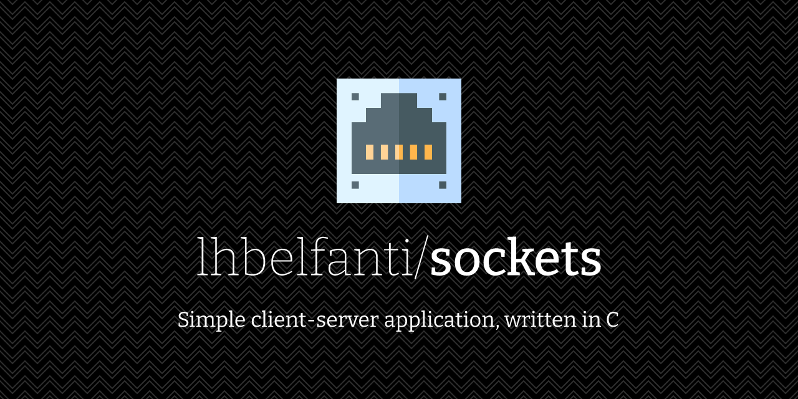

  <picture>
    <source media="(prefers-color-scheme: dark)" srcset="media/sockets-dark.png">
    <source media="(prefers-color-scheme: light)" srcset="media/sockets-light.png">
    
  </picture>

   

  
  

---

# Client-Server

This is a simple client-server application, written in C.

The client can access to static and dynamic resources through the endpoints exposed by the server.

The server is multithreaded. Each request is processed in a new thread. After the thread finishes the processing, all the associated resources are freed.

## Technical information

- It is a console program that receives a listen port as a parameter.
- The solution uses the HTTP v1.1 protocol to accept a browser as a client.
- The protocol used is TCP/IPv4.
- The Berkeley API is used for sockets.
